# Oncho Fitting and Near-Term Projections (Historical Simulations)
## Instructions for running in the Cloud using Docker

## Table of Contents
- [Things to Note](#things-to-note)
- [Setup](#setup)
- [Input Data Sources](#input-data-sources)
- [Pipeline Overview](#pipeline-overview)
  - [Pipeline Stages](#pipeline-stages)
    - [1. Fitting Preparation](#1-fitting-preparation---stage-fitting-prep)
    - [2. Fitting](#2-fitting---stage-fitting)
    - [3. Projections Preparation](#3-projections-preparation---stage-projections-prep)
    - [4. Near-term Projections](#4-nearterm-projections---stage-nearterm-projections)
- [Usage](#usage)
  - [Docker Container Wrapper](#docker-container-wrapper)
  - [Advanced Usage](#advanced-usage)
- [Development and Testing](#development-and-testing)

## Things to Note
- Raiha's Warwick directory only has the recent runs for treatment naive + a few other IUs. Evandro's runs are saved to the cloud, but note that the batch numbers here don't necessarily align with those in my Warwick directory, and some IUs from EKs fits will have been refitted.
- **ESS Threshold Handling**: When IUs have `ESS < ess-threshold (default=200)`, rerun with `amis-sigma=0.025` for better convergence
- Keep note of which IUs had `ESS < ess-threshold` so they can be excluded from future projections (scenarios to 2040)

## Setup
- Clone this repo - [oncho-amis-integration](https://github.com/NTD-Modelling-Consortium/oncho-amis-integration.git).
- At the root of the repo, build the Docker image:
    ```shell
    DOCKER_BUILDKIT=1 docker build --ssh default=$SSH_AUTH_SOCK . -t oncho-amis-pipeline
    ```
    This assumes that you have added the SSH keys on your system to your Github account.

## Input Data Sources

The pipeline requires the following input data files:

### Primary Input Files
- **`Full_histories_df_popinfo_ALL_minimal_070425_listlabels.rds`**: MDA treatment histories and population information for all IUs
  - Contains treatment coverage, adherence parameters, and vector control data from 1975-2025
- **`ALL_prevalence_map.rds`**: Baseline prevalence maps for all IUs
  - Contains prevalence data across 1000 parameter combinations

## Pipeline Overview

The Oncho AMIS pipeline consists of four sequential stages that process implementation units (IUs) through fitting and projection phases. IUs are grouped into batches based on similar treatment histories for efficient processing.

```mermaid
graph TD
    subgraph "External Inputs"
        A["📁 fitting-prep-inputs/<br/>• Full_histories_df_popinfo_ALL_minimal_070425_listlabels.rds<br/>• ALL_prevalence_map.rds"]
    end
    
    subgraph "Stage 1: fitting-prep"
        B["multipletimepoints_preprocess_map_and_histories.R<br/>Input: Treatment histories & prevalence maps"]
        B --> C1["📄 Maps/<br/>ALL_prevalence_map_<br/>multipletimespoints.rds"]
        B --> C2["📄 Maps/<br/>iu_task_lookup.rds"]
        B --> C3["📄 model_output/<br/>IUs_MTP_{id}.csv"]
        B --> C4["📄 model_output/<br/>InputMDA_MTP_{id}.csv"]
        B --> C5["📄 model_output/<br/>InputVC_MTP_{id}.csv"]
    end
    
    subgraph "Stage 2: fitting"
        D["oncho-endgame-multipletimepts.R<br/>+ r_wrapper_endgame_fitting_multipletimepts.py<br/>Input: --id={batch_id}"]
        D --> E1["📄 output_{id}.Rdata<br/>(AMIS results with ESS,<br/>weights, parameters)"]
        D --> E2["📄 trajectories_{id}.Rdata<br/>(Simulated trajectories)"]
    end
    
    subgraph "Stage 3: projections-prep"
        F["multipletimepoints_projections_inputs.R<br/>Input: --id OR --failed-ids"]
        F --> G1["📄 table_iu_idx.csv"]
        F --> G2["📄 InputPars_MTP_allIUS.rds"]
        F --> G3["📄 model_output/<br/>InputPars_MTP_proj_{iu}.csv<br/>(200 parameter samples)"]
        F --> G4["📄 model_output/<br/>InputMDA_MTP_proj_{iu}.csv<br/>(MDA history 1975-2025)"]
        F --> G5["📄 model_output/<br/>InputVC_MTP_proj_{iu}.csv"]
        F --> G6["📄 model_output/<br/>IUs_MTP_proj_{id}.csv"]
    end
    
    subgraph "Stage 4: nearterm-projections"
        H["wrapper-simulations-multipletimepoints.py<br/>Input: --id={batch_id}"]
        H --> I1["📄 OutputVals_MTP_{iu}.hdf5<br/>(Full simulation outputs)"]
        H --> I2["📄 raw_outputs_{iu}.csv"]
        H --> I3["📄 model_output_MTP_{iu}.csv<br/>(NTDMC format prevalence)"]
    end
    
    A --> B
    C1 --> D
    C3 --> D
    C4 --> D
    C5 --> D
    E1 --> F
    C1 --> F
    C2 --> F
    A --> F
    G3 --> H
    G4 --> H
    G5 --> H
    G6 --> H
    
    style A fill:#f9f9f9
    style B fill:#e1f5fe
    style D fill:#fff3e0
    style F fill:#f3e5f5
    style H fill:#e8f5e8
```



### File Name Pattern Key:
- `{id}` - Batch/task ID (e.g., 1, 2, 3...)
- `{iu}` - IU identifier (e.g., ETH00001, NGR00123)
- Files with `_MTP_` indicate "Multiple Time Points" processing

### Key Data Flow Summary:
1. **Input Data**: MDA histories and baseline prevalence maps
2. **Fitting Prep**: Groups IUs by treatment history into batches for efficient processing
3. **Fitting**: Uses AMIS algorithm to fit transmission parameters (k_E, ABR) to prevalence data
4. **Projections Prep**: Samples from posterior distributions and reorganizes data per IU
5. **Nearterm Projections**: Runs forward simulations from 1895 to 2026 using fitted parameters

### Pipeline Stages

#### 1. **Fitting Preparation** (`--stage=fitting-prep`)
**Scripts:**
- `multipletimepoints_preprocess_map_and_histories.R` - Groups IUs by treatment history and generates prevalence maps
- `run_fitting_prep.sh` - Shell wrapper script

**Input Files:**
- `fitting-prep-inputs/Full_histories_df_popinfo_ALL_minimal_070425_listlabels.rds` - MDA histories and population data
- `fitting-prep-inputs/ALL_prevalence_map.rds` - Baseline prevalence maps for all IUs

**Output Location:** `fitting-prep/artefacts/`

**Generated Files:**
- **Maps directory:**
  - `ALL_prevalence_map_multipletimespoints.rds` - Multi-timepoint prevalence maps organized by TaskID
  - `iu_task_lookup.rds` - IU to TaskID (batch) mapping
- **model_output directory:**
  - `IUs_MTP_{id}.csv` - List of IUs per batch
  - `InputMDA_MTP_{id}.csv` - MDA coverage history per batch (1975-2018)
  - `InputVC_MTP_{id}.csv` - Vector control history per batch

**Notes:**
- IUs with identical treatment histories are grouped into the same batch for efficiency
- There is a hard-coded variable `batch_with_no_treatment` for IUs with no MDA/VC history

#### 2. **Fitting** (`--stage=fitting`)
**Scripts:**
- `oncho-endgame-multipletimepts.R` - Main AMIS fitting script
- `r_wrapper_endgame_fitting_multipletimepts.py` - Python wrapper for model simulations
- `run_fitting.sh` - Shell wrapper script

**Input Files:**
- `fitting-prep/artefacts/Maps/ALL_prevalence_map_multipletimespoints.rds` - Multi-timepoint prevalence maps
- `fitting-prep/artefacts/model_output/InputMDA_MTP_{id}.csv` - MDA coverage history
- `fitting-prep/artefacts/model_output/InputVC_MTP_{id}.csv` - Vector control history

**Required Arguments:** `--id`  
**Optional Arguments:** `--amis-sigma`, `--amis-n-samples`, `--amis-target-ess`, `--amis-max-iters`, `--amis-delete-induced-prior`

**Output Location:** `fitting/artefacts/`

**Generated Files:**
- `output_{id}.Rdata` - AMIS algorithm output containing:
  - Fitted parameters (k_E, ABR)
  - Weight matrix for each IU in the batch
  - ESS (Effective Sample Size) values
  - Posterior samples
- `trajectories_{id}.Rdata` - Simulated prevalence trajectories
- `summary.csv` - Summary statistics for all batch runs (if ESS tracking enabled)

**Notes:**
- Monitor ESS values; if `ESS < ess-threshold`, rerun with `amis-sigma=0.025`
- Document IUs with persistently low ESS for exclusion from future projections

#### 3. **Projections Preparation** (`--stage=projections-prep`)
**Scripts:**
- `multipletimepoints_projections_inputs.R` - Samples parameters and prepares projection inputs
- `run_projections_inputs.sh` - Shell wrapper script
- `ius_with_insufficient_ess.r` - Identifies IUs with insufficient ESS (optional utility)

**Input Files:**
- `fitting/artefacts/output_{id}.Rdata` - AMIS fitting results
- `fitting-prep/artefacts/Maps/ALL_prevalence_map_multipletimespoints.rds` - Multi-timepoint maps
- `fitting-prep/artefacts/Maps/iu_task_lookup.rds` - IU to TaskID mapping
- `fitting-prep-inputs/Full_histories_df_popinfo_ALL_minimal_070425_listlabels.rds` - Extended MDA histories (1975-2025)

**Required Arguments:** `--id` OR `--failed-ids`  
**Optional Arguments:** `--amis-n-samples` (default: 200), `--amis-sigma`, `--ess-threshold`

**Output Location:** `projections-prep/artefacts/`

**Generated Files:**
- `table_iu_idx.csv` - IU/TaskID/country lookup table
- `InputPars_MTP_allIUS.rds` - All sampled parameters compiled
- **model_output directory (per IU):**
  - `InputPars_MTP_proj_{iu}.csv` - Sampled parameters (200 samples by default)
  - `InputMDA_MTP_proj_{iu}.csv` - MDA coverage history (1975-2025)
  - `InputVC_MTP_proj_{iu}.csv` - Vector control history with ABR multipliers
  - `IUs_MTP_proj_{id}.csv` - List of IUs for projection batch

**Notes:**
- Samples from posterior distribution obtained during fitting
- Automatically uses higher sigma results for IUs with low ESS
- Reassigns IUs to individual projection tasks (one IU per task)

#### 4. **Near-term Projections** (`--stage=nearterm-projections`)
**Scripts:**
- `wrapper-simulations-multipletimepoints.py` - Runs forward simulations to 2026
- `run_projections_to_2026.sh` - Shell wrapper script

**Input Files:**
- `projections-prep/artefacts/model_output/IUs_MTP_proj_{id}.csv` - IU list
- `projections-prep/artefacts/model_output/InputPars_MTP_proj_{iu}.csv` - Sampled parameters
- `projections-prep/artefacts/model_output/InputMDA_MTP_proj_{iu}.csv` - MDA coverage history
- `projections-prep/artefacts/model_output/InputVC_MTP_proj_{iu}.csv` - Vector control history

**Required Arguments:** `--id`  
**Optional Arguments:** `--amis-n-samples` (should match projections-prep value)

**Output Location:** `projections/artefacts/model_output/`

**Generated Files:**
- `OutputVals_MTP_{iu}.hdf5` - Full simulation outputs in HDF5 format
- `raw_outputs_{iu}.csv` - Raw simulation data
- `model_output_MTP_{iu}.csv` - Processed prevalence projections (NTDMC format)

## Cross-Stage Dependencies

The pipeline has both linear and cross-stage dependencies:

- **Linear Dependencies**: Each stage depends on outputs from the previous stage
- **Fitting → Projections Prep**: AMIS outputs (`output_{id}.Rdata`) are required for parameter sampling
- **Projections Prep → Projections**: Individual IU parameter files are required for simulations
- IUs are rebatched between fitting (grouped by history) and projections (individual processing)

## Usage

### Docker Container Wrapper

The `run_container.sh` script provides a wrapper around Docker that handles the pipeline execution. In normal usage, this is the only script needed.

**Note**: The shell scripts in each stage setup the Python virtual environment correctly and should be used rather than calling Python/R scripts directly.

Its usage is as follows - 
```shell
usage: run_pipeline.py [-h] -i ID [--failed-ids FAILED_IDS]
                       [--stage {fitting-prep,fitting,projections-prep,nearterm-projections,all,skip-fitting-prep}]
                       [--amis-sigma AMIS_SIGMA]
                       [--amis-target-ess AMIS_TARGET_ESS]
                       [--amis-n-samples AMIS_N_SAMPLES]
                       [--amis-max-iters AMIS_MAX_ITERS]
                       [--ess-threshold ESS_THRESHOLD]

Run the oncho AMIS pipeline end-to-end

options:
  -h, --help            show this help message and exit
  -i ID, --id ID        Batch/task ID to process
  --failed-ids          FAILED_IDS
                        Comma-separated list ('id1,id2,id3...') of failed
                        batch/task IDs to skip. Only used when --id is not
                        specified and in the Projections-Prep stage.
  --stage               {fitting-prep,
                         fitting,
                         projections-prep,
                         nearterm-projections,
                         all,skip-fitting-prep}
                        Stage of the pipeline to run.
                        Options: 'fitting-prep',
                                 'fitting',
                                 'projections-prep',
                                 'nearterm-projections',
                                 'all',
                                 'skip-fitting-prep'.
                                Default is 'skip-fitting-prep'.
                        If 'all' is specified, it runs all stages in order.
                        If 'skip-fitting-prep' is specified, it skips
                        the fitting-prep stage.
  --amis-sigma          AMIS_SIGMA
                        AMIS 'sigma' parameter (default: 0.0025)
  --amis-target-ess     AMIS_TARGET_ESS
                        Target ESS parameter for AMIS (default: 500)
  --amis-n-samples      AMIS_N_SAMPLES
                        Number of AMIS samples (default: 500)
  --amis-max-iters      AMIS_MAX_ITERS
                        Maximum number of AMIS iterations (default: 50)
  --ess-threshold       ESS_THRESHOLD
                        ESS threshold parameter (default: 200)
  --amis-delete-induced-prior       Flag controlling whether induced prior density is to be deleted when updating weights.
                                    Is taken to be False if the flag is not specified.
```

### Basic Usage

Run the Docker container with default parameters:

```shell
# Run full pipeline (skipping fitting-prep if pre-generated artefacts exist)
bash run_container.sh --stage=skip-fitting-prep --id=11

# Run individual stages
bash run_container.sh --stage=fitting-prep --id=1
bash run_container.sh --stage=fitting --id=1
bash run_container.sh --stage=projections-prep --id=1
bash run_container.sh --stage=nearterm-projections --id=1

# Run with custom AMIS parameters for difficult convergence
bash run_container.sh --stage=fitting --id=11 --amis-sigma=0.025

# Handle failed IDs in projections-prep
bash run_container.sh --stage=projections-prep --failed-ids=1,2,3
```

The script will automatically:
- Mount the correct directories for input/output
- Setup the Python virtual environment
- Copy artefacts to the host's `artefacts` directory upon successful completion

### Advanced Usage

For direct Docker usage without the wrapper script:

```shell
# Manual Docker run with volume mounts
docker run --rm \
  -v $(pwd)/fitting-prep/artefacts:/ntdmc/oncho-amis-integration/fitting-prep/artefacts \
  -v $(pwd)/fitting/artefacts:/ntdmc/oncho-amis-integration/fitting/artefacts \
  -v $(pwd)/projections-prep/artefacts:/ntdmc/oncho-amis-integration/projections-prep/artefacts \
  -v $(pwd)/projections/artefacts:/ntdmc/oncho-amis-integration/projections/artefacts \
  oncho-amis-pipeline:latest \
  --stage=fitting --id=11

# Copy artefacts after manual run
docker cp "oncho-amis-pipeline:fitting/artefacts/." "artefacts/fitting/"
```

## Development and Testing

### Speeding up the Pipeline

For testing, use reduced AMIS parameters:

```shell
bash run_container.sh \
  --id=1 \
  --amis-sigma=0.025 \
  --amis-n-samples=10 \
  --amis-target-ess=1 \
  --ess-threshold=1
```

### Failed Batch Handling

When batches fail to reach ESS threshold:

```shell
# 1. Identify failed batches from summary.csv or ESS_NOT_REACHED.txt
# 2. Rerun with relaxed sigma parameter
bash run_container.sh --stage=fitting --id=11 --amis-sigma=0.025

# 3. Process all IDs except failed ones in projections-prep
bash run_container.sh --stage=projections-prep --failed-ids=1,2,3
```

### Environment Variables

The pipeline uses the following environment variables (set automatically by Docker):

- `PATH_TO_FITTING_PREP_INPUTS`: Input data directory
- `PATH_TO_FITTING_PREP_ARTEFACTS`: Fitting preparation outputs
- `PATH_TO_FITTING_ARTEFACTS`: Fitting outputs
- `PATH_TO_PROJECTIONS_PREP_ARTEFACTS`: Projections preparation outputs
- `PATH_TO_PROJECTIONS_ARTEFACTS`: Projections outputs
- `ONCHO_AMIS_DIR`: Working directory for the pipeline
- `ONCHO_MODEL_DIR`: EPIONCHO-IBM model directory

### Notes

- **Batch Assignment**: IUs are grouped by treatment history for fitting, then processed individually for projections
- **ESS Monitoring**: Track Effective Sample Size to ensure convergence quality
- **File Validation**: Scripts validate required input files exist before proceeding
- **Error Recovery**: Failed batches can be rerun with adjusted parameters without reprocessing successful ones
